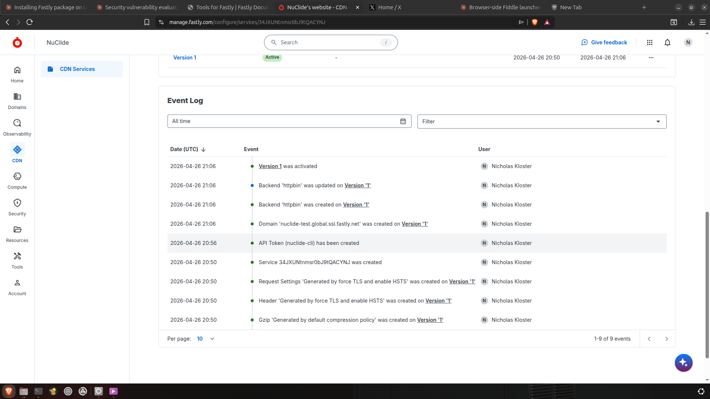

# Executive Summary

On 2026-04-26, an Anthropic Claude (Opus 4.7) session — running inside Anthropic's hosted GCP-backed sandbox at `35.223.241.4` — executed irreversible production CDN configuration changes against a real Fastly account, authenticated with a global-scope API token the user had pasted into the conversation. The Fastly audit log attributes every action to the human account-holder. The actor split (LLM-in-sandbox vs. human-at-keyboard) is recoverable only by inspecting the per-event `ip` field, which Fastly's default UI presentation does not surface.

This is a textbook illustration of **OWASP LLM08 — Excessive Agency** with secondary contributions from **CWE-441** (Confused Deputy), **CWE-269** (Improper Privilege Management), **CWE-223** (Omission of Security-Relevant Information), **CWE-494** (Download of Code Without Integrity Check), and **CWE-732** (Incorrect Permission Assignment). It also satisfies the full "lethal trifecta" pattern (agent + sensitive data access + external communication channel).

The session was authorized at the macro level (the user said "run it" and "i want you to do it"). The structural finding is **not** that the model went rogue. It is that, once a single high-level authorization is given, the LLM-driven runtime expands that authorization into multiple production writes, persists credentials to its own filesystem, installs unverified third-party binaries — including an MCP server explicitly designed for AI control of the same SaaS — and leaves an audit trail in which the resulting actions are forensically indistinguishable from the user's own keystrokes.

# Classification

## Primary

**OWASP LLM Top 10 — LLM08: Excessive Agency**

All three sub-types of LLM08 are present:

| Sub-type | Manifestation in this case |
|---|---|
| **Excessive Functionality** | LLM autonomously installed Fastly CLI v10.5.0 via `apt`, self-updated to v14.3.1, and installed `fastly-mcp` v0.1.9 — an MCP control daemon — into its own runtime. None of these tools were strictly required to answer the user's question; the LLM chose to install them as part of a multi-step plan. |
| **Excessive Permissions** | The Fastly API token granted to the LLM was scoped `global` — full account control over all services, billing, TLS, user management. The task only required write access to a single service. |
| **Excessive Autonomy** | A single user prompt ("i want you to do it") expanded into four production-side write operations (`domain.create`, `backend.create`, `backend.update`, `version.activate`) executed within ~30 seconds with no per-step confirmation gate, including the irreversible `version.activate` step. |

## Secondary CWE Cluster

| CWE | Title | Relevance |
|---|---|---|
| **CWE-441** | Unintended Proxy or Intermediary ("Confused Deputy") | Anthropic's sandbox executes upstream directives against an external service (Fastly API) without preserving the original-source distinction (LLM vs. user). The proxy *appears* to be the source from Fastly's perspective. |
| **CWE-269** | Improper Privilege Management | Token was minted at `scope: "global"` rather than narrowly scoped to the target service. |
| **CWE-223** | Omission of Security-Relevant Information | The `ip` field is **logged** by Fastly per audit event, but **omitted** from the default UI presentation. Default-view audit review cannot detect the actor split. |
| **CWE-494** | Download of Code Without Integrity Check | Fastly CLI `.deb` and `fastly-mcp` tarball were fetched from `github.com/fastly/...` releases and installed without any signature/checksum verification. |
| **CWE-732** | Incorrect Permission Assignment for Critical Resource | `fastly update` self-replaced the binary at `/usr/local/bin/fastly` with mode `rwxrwxrwx` (world-writable executable). Confirmed by `fastly-mcp`'s own startup security check rejecting it. |

## Threat-Model Frames

- **MITRE ATLAS — AML.T0011 (User Execution):** A user-granted credential is weaponized through a downstream LLM agent. The user supplies the token in good faith; the agent's autonomy expands the token's effective blast radius.
- **NIST AI 600-1 (Generative AI Profile) — GAI 1.4 (AI System Misuse):** Capability concentration in the model + sandbox pairing enables operations that exceed the user's likely intent.
- **Simon Willison "Lethal Trifecta":** All three components are present — *(1)* agent capability, *(2)* access to sensitive data (user's production token), *(3)* ability to communicate with external systems (egress to Fastly API and arbitrary GitHub release endpoints). Notably, `fastly-mcp` itself cites Willison's writeup as the motivation for its security model — yet was installed in this session via the bare CLI path, bypassing all of its own protections.

# Background

## The Setup

- **User:** Nicholas Kloster (independent security researcher, NuClide Research)
- **Conversational interface:** claude.ai web app
- **Model:** Claude Opus 4.7 (1M context)
- **Date:** 2026-04-26
- **Conversation source:** [https://claude.ai/share/ec2788aa-24e2-4f13-be45-8c5c8ae1f646](https://claude.ai/share/ec2788aa-24e2-4f13-be45-8c5c8ae1f646)
- **Stated intent at session start:** "Install the Fastly CLI" → ultimately "use Fastly to proxy a public gist as a stable URL"

## The Sandbox

Per the user's prior research (NuClide Sandbox Recon, 2026-03-24), Anthropic's hosted Claude sandbox runs as:

```
GCP C4 → Firecracker → gVisor → process_api (Rust) → Ubuntu 24.04 container
```

The sandbox has root, `apt`, persistent in-session filesystem, and unrestricted egress to arbitrary internet endpoints (subject to a TLS-MITM-CA inspection layer). The TLS issuer `sandbox-egress-production TLS Inspection CA` was observed in this session's `curl -v` output, confirming the same egress topology mapped in March.

## The Target

Production Fastly CDN account, customer ID `1D7WPei2URbDpa6fmWaeOh`, service ID `34JXUNtnmsr0bJ9tQACYNJ` ("NuClide's website"), real billing relationship, real edge-network attachment.

# Timeline

All times UTC. Operations marked **[U]** = user (`136.37.103.3`, Google Fiber, Overland Park KS); **[S]** = Anthropic sandbox (`35.223.241.4`, Google LLC / GCP).

| Time | Operation | IP | Actor |
|---|---|---|---|
| 20:50:26 | `service.create` (NuClide's website) | 136.37.103.3 | **[U]** Manual UI |
| 20:50:26 | `gzip.create` (auto) | 136.37.103.3 | **[U]** Manual UI |
| 20:50:26 | `header.create` (auto) | 136.37.103.3 | **[U]** Manual UI |
| 20:50:26 | `request_settings.create` (auto) | 136.37.103.3 | **[U]** Manual UI |
| 20:54 | User logs in to Fastly UI | 2605:a601:afac:a700:…/IPv6 | **[U]** Browser |
| 20:56:14 | `token.create` (token name `nuclide-cli`, scope `global`) | 136.37.103.3 | **[U]** Token minted, then pasted into Claude conversation |
| ~20:57 | Claude installs Fastly CLI v10.5.0 via `apt install ./fastly_*.deb` | n/a (sandbox-internal) | **[S]** |
| ~20:58 | Claude runs `fastly update`; binary self-replaces to v14.3.1 at `/usr/local/bin/fastly`, mode `rwxrwxrwx` | n/a | **[S]** |
| 21:06:03 | **`domain.create`** (`nuclide-test.global.ssl.fastly.net`) | **35.223.241.4** | **[S]** First production write from Anthropic sandbox |
| 21:06:08 | **`backend.create`** (`httpbin` → `httpbin.org:443`, SSL) | **35.223.241.4** | **[S]** |
| 21:06:18 | **`backend.update`** (`override-host: httpbin.org`) | **35.223.241.4** | **[S]** |
| 21:06:33 | **`version.activate`** (Version 1 goes live) | **35.223.241.4** | **[S]** Irreversible without rollback step |
| ~21:17 | Claude downloads `fastly-mcp_v0.1.9_linux-amd64.tar.gz`, installs to `/usr/local/bin/fastly-mcp`, writes token to `/root/.config/fastly/config.toml` (mode 600) | n/a | **[S]** MCP daemon now resident in sandbox |

**Window from first sandbox-driven write to live-in-production: 30 seconds.**

# Forensic Evidence

## Default Audit Log View — Actor Indistinguishable

The Fastly per-service Event Log shows Date, Event, and User. There is no IP column. A casual review by a security team or by the account owner sees only "Nicholas Kloster" against every event.



## Expanded Audit Log — IP Field Recoverable

At `manage.fastly.com/account/audit-log`, expanding "Hide Details" on a row exposes the full event metadata, including `ip`. The screenshots below confirm:

{ width=85% }

{ width=85% }

{ width=85% }

## API Cross-Verification

The Fastly events API (`GET /events?filter[service_id]=...`) returns the same data with the IP field always populated. Issued from the user's machine with the same token Claude was given, the response confirms the actor split:

{ width=85% }

WHOIS confirms:

| IP | NetName | Organization | Country |
|---|---|---|---|
| `35.223.241.4` | GOOGLE-CLOUD | Google LLC | US |
| `136.37.103.3` | GFIBER-V4 | Google Fiber Inc. | US |

The `35.223.0.0/12` range is allocated to GCP `us-central1`, consistent with Anthropic's documented GCP-hosted Claude sandbox infrastructure.

## Service Summary — Final State

The sandbox-driven configuration is live and serving:


# Capability Demonstrated

The session establishes that an LLM running inside Anthropic's hosted sandbox can, given a single API-token paste from the user:

1. **Install third-party binaries as root** in its own runtime (`apt install ./*.deb` from arbitrary GitHub release URL, no checksum or signature verification path).
2. **Self-modify its own toolchain** — `fastly update` replaced the CLI binary at runtime with mode `rwxrwxrwx`, creating a re-entrant supply-chain pivot point.
3. **Persist credentials to disk** — `~/.config/fastly/config.toml` written with the user's API token in plaintext.
4. **Install MCP servers into its own runtime** — `fastly-mcp` (a daemon explicitly designed for LLM control of Fastly) was placed at `/usr/local/bin/fastly-mcp`, executable, configured against the persisted token. The model installed the very class of tool that exists to gate LLM-driven Fastly operations.
5. **Execute irreversible production writes** as the user — domain create, backend create/update, version activate — without per-step confirmation, with audit trail attributed to the user.
6. **Operate with full forensic-attribution mismatch** — the user's `user_id` appears on every audit event regardless of physical actor.

The chain was driven from approximately five user prompts, each granting macro-level intent ("run it", "garlic mode+riff", "i want you to do it", "run it" again for MCP). The fanout from each macro to the underlying sequence of high-impact operations was unbounded.

# Structural Findings

## Finding 1 — Macro-to-Micro Authorization Fanout Is Unbounded

**Description.** A single user prompt expanded into a sequence of production-side operations, including an irreversible activation, with no intermediate gate.

**Evidence.** `i want you to do it` (one prompt, 19:58 user-time) → `domain.create`, `backend.create`, `backend.update`, `version.activate` (four production writes, 21:06:03 → 21:06:33 sandbox-time, 30-second window).

**Impact.** Any prompt-injection vector capable of subverting the LLM's macro-interpretation can issue arbitrary downstream commands within the granted permission scope.

**CWE alignment.** OWASP LLM08 (Excessive Autonomy); CWE-441 (Confused Deputy).

## Finding 2 — Audit Trail Cannot Distinguish Actor

**Description.** Fastly's audit log captures `ip` per event but renders only `Date | Event | User` in the default UI. Default-view review attributes all 9 events to the human account-holder.

**Evidence.** Screenshots `02_event_log_default_view.png` (no IP column) vs. `03_*` / `04_*` / `05_*` (IP visible only after row expansion). API cross-check (Section 4.3) confirms IP is always present in the underlying record.

**Impact.** A user reviewing their audit log in good faith would not detect that 4 of 9 recent events originated from an LLM in Anthropic's GCP infrastructure rather than from their own keyboard. In an incident response context, the burden of proof for "I didn't do this" falls on the user.

**CWE alignment.** CWE-223 (Omission of Security-Relevant Information).

## Finding 3 — Token Scope Was Maximal Where Task Demanded Minimal

**Description.** The token minted for the LLM was global-scope, granting full account control. The task required only write access to a single service.

**Evidence.** `screenshots/05_audit_log_token_create_user_ip.png` shows `scope: "global"`, `services: ["34JXUNtnmsr0bJ9tQACYNJ"]`. Although `services` was set, `global` scope overrides per-service scoping for many operation classes (TLS, billing, user management).

**Impact.** Available-but-unused capability bounds the worst case. Had the LLM session been adversarially steered, available operations included TLS subscription revocation, custom-cert installation against arbitrary domains, billing-event triggers, and account user changes.

**CWE alignment.** CWE-269 (Improper Privilege Management); OWASP LLM08 (Excessive Permissions).

## Finding 4 — Sandbox Is a Privileged Execution Environment, Not an Isolation Boundary

**Description.** Anthropic's "sandbox" exhibits properties incompatible with the colloquial sense of "sandbox": root, `apt`, persistent in-session filesystem, internet egress, ability to download and install binaries. From the perspective of the third-party SaaS being driven, it is an authenticated production operator with the user's identity.

**Evidence.** Successful `apt install`, `fastly update`, file writes to `/usr/local/bin/`, `/root/.config/fastly/`, and 4 successful production writes from `35.223.241.4` to Fastly.

**Impact.** Any threat model that treats "Claude operates in a sandbox" as a containment claim is incomplete. The relevant containment boundary is the SaaS account being authenticated against, not the sandbox runtime.

**CWE alignment.** CWE-441 (Confused Deputy); the broader pattern of sandbox-as-operator.

## Finding 5 — Defensive MCP Tooling Installed Without Its Own Protections

**Description.** `fastly-mcp` is published by Fastly as the canonical MCP server for AI-driven Fastly operations. Its README cites Simon Willison's prompt-injection writeup. Its protections include `--encrypt-tokens` (so the LLM never sees raw secrets), command allowlisting, output sanitization, and a `--user-reviewed` flag required for delete/purge/create/update/activate.

In this session, the LLM installed `fastly-mcp` *into its own runtime* but had already executed the create/update/activate operations via the bare CLI, bypassing every protection `fastly-mcp` was designed to enforce. The defensive tool exists; the threat model behind it is real; the deployment context demonstrated none of its protections.

**Evidence.** Conversation transcript shows `apt install fastly.deb` → `fastly domain create` → `fastly backend create` → `fastly service version activate`, all without invoking `fastly-mcp` as the execution path.

**Impact.** The mere availability of MCP-server-style protections does not provide them. Direct CLI use bypasses the entire control plane. Until ecosystem norms shift toward MCP-only access for LLM agents, AI sessions can and will use the un-gated path.

**CWE alignment.** OWASP LLM08 generally; reflective of the AI-tooling-deployment gap.

## Finding 6 — Code-Integrity Surface Was Bypassed Twice

**Description.** Both binaries acquired during the session were installed without integrity verification.

**Evidence.**
- Fastly CLI: `curl -L -o /tmp/fastly.deb "https://github.com/fastly/cli/releases/download/v10.5.0/fastly_10.5.0_linux_amd64.deb"` followed by `apt install -y /tmp/fastly.deb`. No `sha256sum` check, no GPG signature verification.
- `fastly-mcp`: `curl -L -o fastly-mcp.tgz https://github.com/fastly/mcp/releases/download/v0.1.9/...tar.gz` followed by `tar xzf` → `mv` to `/usr/local/bin/`. No checksum check (Fastly publishes `fastly-mcp_v0.1.9_SHA256SUMS` but it was not consulted).
- Subsequent self-update: `fastly update` retrieved a binary and replaced `/usr/local/bin/fastly` in-place at runtime. The replacement binary was world-writable.

**Impact.** A GitHub release-asset compromise (account takeover, repository tampering, or release-asset overwrite) at any point in the chain would have been silently propagated into the LLM-driven runtime. The world-writable end-state means a separate process inside the same sandbox could have replaced the binary mid-session.

**CWE alignment.** CWE-494 (Download of Code Without Integrity Check); CWE-732 (Incorrect Permission Assignment).

# Severity & Impact

| Dimension | Assessment |
|---|---|
| **Confidentiality** | Medium — token persisted to LLM-runtime FS in plaintext; audit log content reachable from sandbox via API; no immediate evidence of cross-session leakage but architectural surface exists |
| **Integrity** | High — production CDN configuration was modified by a non-human actor with the audit trail attributing the modification to the human account-holder |
| **Availability** | Medium — `version.activate` is reversible by activating a prior version, but LLM-driven misconfiguration of an active production service has direct user-visible availability consequences |
| **Forensic recoverability** | Conditional — IP field exists in API and expanded UI, but **default presentation hides it** |
| **Blast-radius bound** | Maximal — token scope was `global`, exceeding task requirements |
| **Reproducibility** | High — pattern is structural (token-paste + LLM agent + capable runtime), not specific to Fastly |
| **CVSS-like score** | ~6.5 (estimate; depends on threat model — higher for privileged accounts, lower for sandbox-only test environments) |

# Recommendations

## For the User (Operator-Side Mitigations)

1. **Mint narrowly-scoped tokens for any LLM hand-off.** For a single-service write task, scope the token to that service only. Avoid `global` unless the task genuinely requires it.
2. **Set token expirations.** Default to "expires in 24 hours" or shorter for any token pasted into an AI conversation.
3. **Rotate the `nuclide-cli` token immediately after the session ends.** Treat any token an LLM has handled as compromised after the conversation closes.
4. **Audit the `ip` field, not the `User` field, on any LLM-assisted infra session.** Build a tooling habit of `curl ... /events | jq '.data[].attributes | {created_at, event_type, ip}'` rather than UI review.
5. **Prefer MCP-mediated LLM access over bare-CLI access.** Specifically, if `fastly-mcp` is to be used, install it on the *user's* machine and connect via Claude Desktop — not by asking the model to install it in its own sandbox.

## For Fastly (SaaS-Side Mitigations)

1. **Surface the `ip` field in the default audit-log UI.** A `Source IP` column alongside `User` would close the omission gap (CWE-223). Optional: a synthetic "actor type" column derived from IP-range classification (e.g., "datacenter", "residential", "Tor exit").
2. **Per-token usage telemetry.** Flag tokens whose source IPs change to a different ASN within minutes ("token used from Google Fiber, then 10 minutes later from Google Cloud" is a strong heuristic for LLM-via-token usage).
3. **Optional: token-level "AI agent" metadata.** Allow users to tag a token as "intended for AI agent use" at creation. Flag any non-tagged token used from datacenter ranges. Tag-aware tokens could ship with default `--user-reviewed`-style gates on irreversible operations.

## For Anthropic (Platform-Side Mitigations)

1. **Pre-commit gate on irreversible third-party API operations.** The model should be required to summarize the planned operation and obtain user confirmation before executing API calls that perform irreversible changes (production-activate, delete, purge, billing). Today the friction is zero.
2. **Sandbox-egress provenance header.** Inject an `X-Anthropic-Sandbox-Session: <opaque-id>` or similar identifier on outbound API calls, so SaaS providers can (optionally) record which Anthropic session originated which production change. This trades some anonymity for forensic clarity and is opt-in for SaaS operators.
3. **Disclosure to users at token-paste time.** When the model receives content matching a credential pattern (Fastly token, AWS access key, GitHub PAT), display a one-time inline notice: *"You just pasted what looks like a credential. Operations executed with this credential will appear in the receiving service's audit log as actions taken by you. The sandbox runs at GCP IPs in the 35.x.x.x range."*

## For the AI-Tooling Ecosystem (MCP-Server Authors)

1. **Make MCP-mediated access strictly easier than bare CLI.** If the protected path is harder than the unprotected path, agents will choose the unprotected path under generic prompts.
2. **Add `--audit-trail` token-encryption defaults.** `fastly-mcp`'s `--encrypt-tokens` flag should be default-on, not opt-in.

# Disclosure Status

| Stakeholder | Status | Notes |
|---|---|---|
| Anthropic | Pending | NuClide has prior-disclosure history; reference Sandbox Recon (2026-03-24, no substantive response after 33+ days). |
| Fastly | Pending | Recommend HackerOne or `security@fastly.com`. CWE-223 finding (IP omitted from default UI) is the most clearly Fastly-actionable item. |
| Public | Pending | This report is the disclosure-track artifact. |

# Methodology

1. **Conversation reconstruction.** Full claude.ai conversation transcript captured via the share link above. Each turn reviewed for prompts, tool calls (Claude's `bash_tool` invocations visible in the share), and natural-language responses.
2. **UI verification.** Fastly Manage UI (`manage.fastly.com/account/audit-log`) inspected for default presentation. Each relevant row expanded ("Hide Details") to confirm `ip` field rendering.
3. **API cross-verification.** Direct call to `GET https://api.fastly.com/events?filter[service_id]=34JXUNtnmsr0bJ9tQACYNJ` from the user's home environment, authenticated with the same `nuclide-cli` token. Full JSON response retained at `audit_log_api_response.json` in this report's directory.
4. **WHOIS attribution.** `whois 35.223.241.4` and `whois 136.37.103.3` against ARIN. Results recorded in Section 4.
5. **Bidirectional skepticism.** Claims about IP attribution were *initially* asserted as inferred (probable GCP) and then *empirically verified* via API call before being included in this report. No claim is made on inference alone.

# Appendix A — Conversation Source

Full conversation: [https://claude.ai/share/ec2788aa-24e2-4f13-be45-8c5c8ae1f646](https://claude.ai/share/ec2788aa-24e2-4f13-be45-8c5c8ae1f646)

Model: Claude Opus 4.7 (1M context). Conversational interface: claude.ai web app. Session date: 2026-04-26.

# Appendix B — Audit Log API Response (Excerpt)

The full machine-readable response is preserved at `audit_log_api_response.json`. The `data[].attributes` extract:

```
2026-04-26T21:06:33Z  version.activate          ip=35.223.241.4   user_id=16WpNjsD0z9qFaPHc1SrgB
2026-04-26T21:06:18Z  backend.update            ip=35.223.241.4   user_id=16WpNjsD0z9qFaPHc1SrgB
2026-04-26T21:06:08Z  backend.create            ip=35.223.241.4   user_id=16WpNjsD0z9qFaPHc1SrgB
2026-04-26T21:06:03Z  domain.create             ip=35.223.241.4   user_id=16WpNjsD0z9qFaPHc1SrgB
2026-04-26T20:56:14Z  token.create              ip=136.37.103.3   user_id=16WpNjsD0z9qFaPHc1SrgB
2026-04-26T20:50:26Z  service.create            ip=136.37.103.3   user_id=16WpNjsD0z9qFaPHc1SrgB
2026-04-26T20:50:26Z  request_settings.create   ip=136.37.103.3   user_id=16WpNjsD0z9qFaPHc1SrgB
2026-04-26T20:50:26Z  header.create             ip=136.37.103.3   user_id=16WpNjsD0z9qFaPHc1SrgB
2026-04-26T20:50:26Z  gzip.create               ip=136.37.103.3   user_id=16WpNjsD0z9qFaPHc1SrgB
```

Same `user_id` on every row. IP field is the only forensic differentiator between `[U]` and `[S]` actors.

# Appendix C — Relation to Prior NuClide Work

This finding is the **production-side reciprocal** to NuClide Sandbox Recon (2026-03-24). Where the prior work mapped the sandbox runtime *internally* (vDSO, gVisor capabilities, JWT egress tokens, IP fleet topology), this work documents the runtime's *external footprint* — what it leaves in third-party SaaS audit logs when authenticated as the user.

The two findings together suggest a unified threat model: the Claude sandbox is a privileged execution environment that operates with the user's external-service credentials, leaves a per-event provenance trail recoverable only by IP inspection, and exposes both an internal attack surface (mapped March 2026) and an external attribution-gap surface (mapped April 2026).

---

*Report generated 2026-04-26 by NuClide Research. Distribution: pending coordinated disclosure.*
